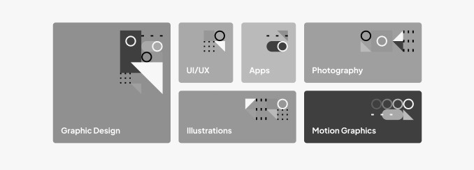
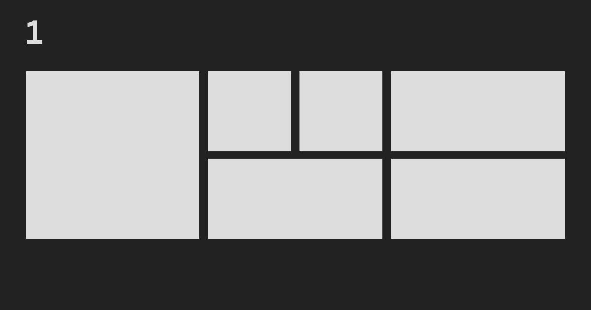
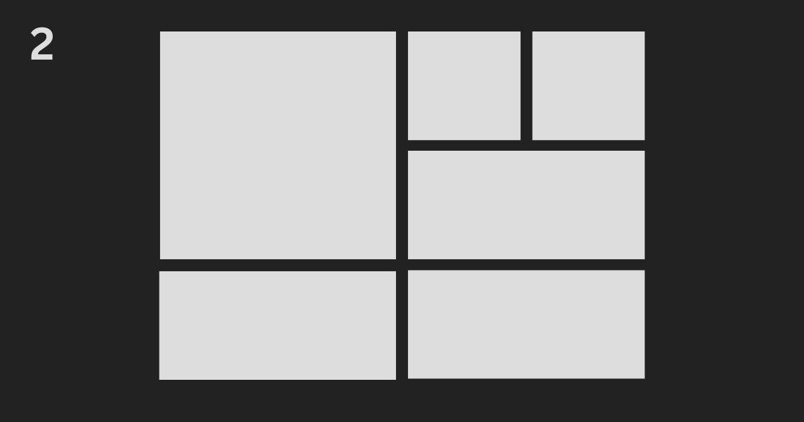
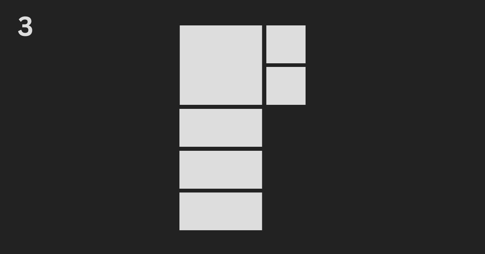
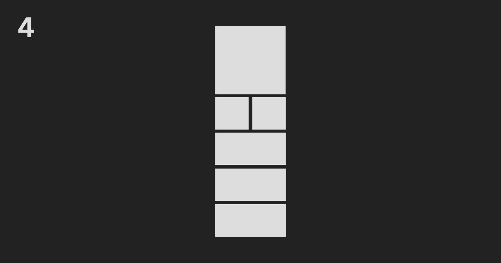
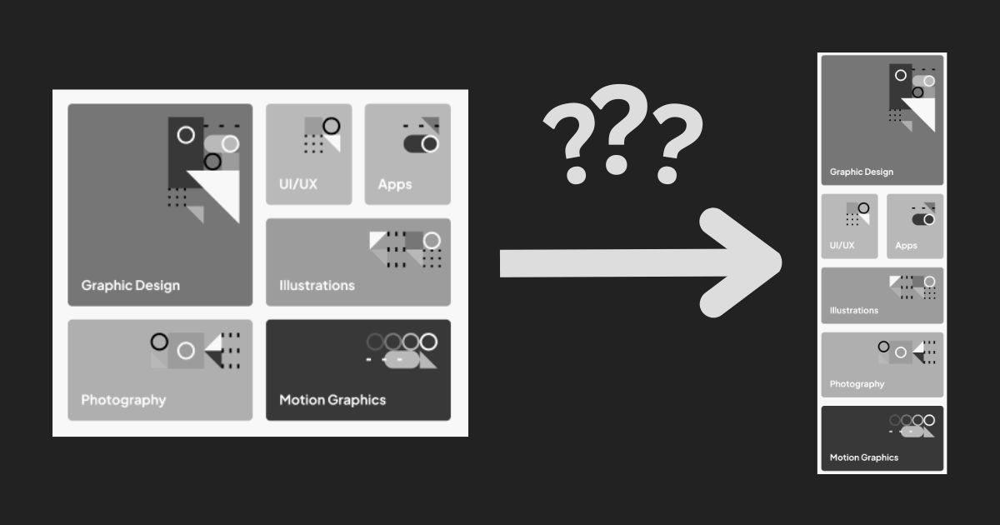
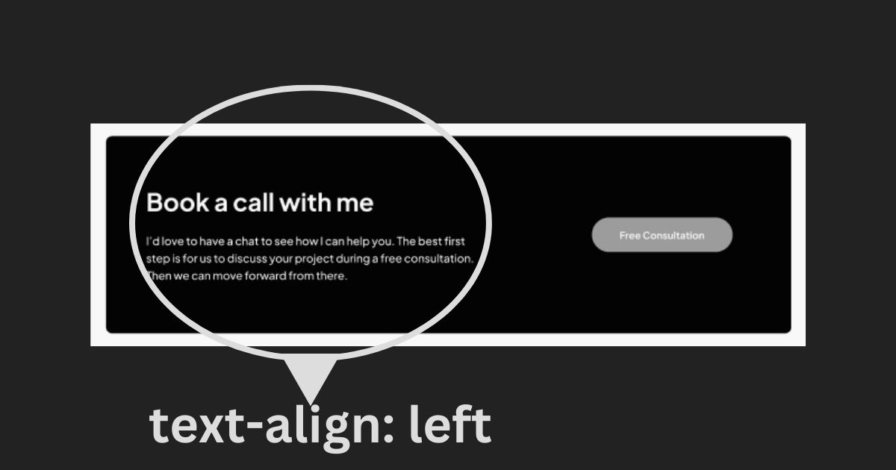
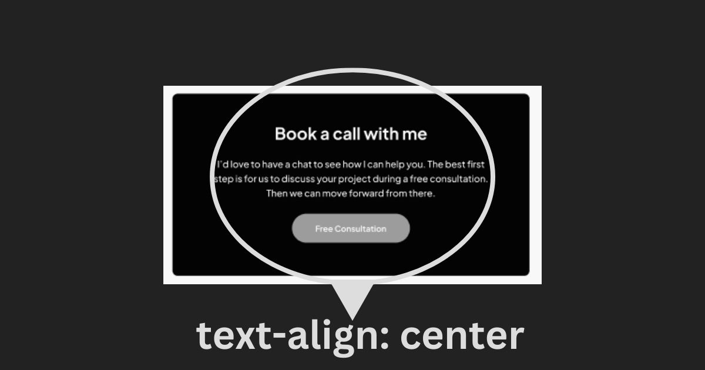
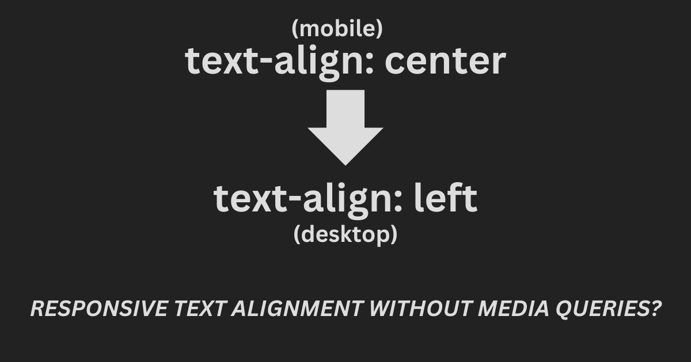

<picture>
  <source media="(prefers-color-scheme: dark)" srcset="./design/dark-banner.jpg">
  <source media="(prefers-color-scheme: light)" srcset="./design/light-banner.jpg">
  
</picture>

# Single-Page Design Portfolio

Slider is the hardest part of this challenge.

I also tried to create the website without any breakpoints. But, I could not do it. I ended up making the website responsive with one breakpoint.

## The challenge

My challenge is to build out this single-page design portfolio site and get it looking as close to the design as possible.

My users should be able to:

- View the optimal layout for the site depending on their device's screen size
- See hover and focus states for all interactive elements on the page
- Navigate the slider using either their mouse/trackpad or keyboard

## Fun fact

When I got started on this challenge, I thought it was the Single-page *developer* portfolio, **not** the *designer* one.

This is what I thought I was going to do — [Frontend Mentor | Single-page developer portfolio coding challenge](https://www.frontendmentor.io/challenges/singlepage-developer-portfolio-bBVj2ZPi-x)

I decided to do this challenge anyway to try learning creating a slider.

## Explore this project

- [Live review](https://amydesigner.netlify.app/)
- [Frontend Mentor solution page](https://www.frontendmentor.io/solutions/responsive-singlepage-design-portfolio-with-grid-and-flexbox-9PaN6fcQ9T)
- [Documentation](./docs/README.md)

## Built with

- HTML
- [BEM (Block, Element, Modifier)](https://sparkbox.com/foundry/bem_by_example)
- [Sass](https://sass-lang.com/)
- JavaScript
- CSS Flexbox
- CSS Grid
- Mobile-first workflow
- [scriptex/hover-media-query](https://github.com/scriptex/hover-media-query) - a progressively enhanced "hover" media query.

## What I learned

I learned about responsive design and making a slider.

### Carousel and slider are *probably* different

Slider is something like [Color Viewer Slider](https://www.w3.org/WAI/ARIA/apg/patterns/slider/examples/slider-color-viewer/) and [Vertical Temperature Slider](https://www.w3.org/WAI/ARIA/apg/patterns/slider/examples/slider-temperature/).

A slider can be a way to say a range input element — [`<input type="range">` - HTML: HyperText Markup Language | MDN](https://developer.mozilla.org/en-US/docs/Web/HTML/Element/input/range).

While carousel is something like this — [A Working Example of Carousel from Web Accessibility Initiative (WAI)](https://www.w3.org/WAI/tutorials/carousels/working-example/).

A carousel can move automatically. A slider can not do that. Probably.

### Impossible mission

I want to create the "list layout" without breakpoints or media queries.



I came up with this CSS Grid algorithm.

For your information, an algorithm is a step-by-step process to solve a problem. In this case, it is a step-by-step instruction for a browser to create the "list layout" without any media queries.

```css
.hero [role="list"] {
  grid-template-columns: repeat(auto-fit, minmax(min(100%, 10rem), 1fr));
}
```

That code does not satisfy one thing.

Let us take a look at the responsiveness of that code step by step.

**Step one, the desktop layout.** It works as expected.



**Step two, the tablet layout.** It works as expected.



**Step three, the awkward layout.** It is not a good layout.



**Step four, the mobile layout.** It works as expected.



Now, my question is **how to bypass the "step three" layout?**



I tried different ways but I did not manage to remove the "step three" layout.

```css
.hero [role="list"] {
  grid-template-columns: repeat(auto-fit, minmax(min(100%, 10rem), 1fr));
  grid-template-columns: repeat(auto-fit, minmax(min(100%, 8.125rem), 1fr));
  grid-template-columns: repeat(
    auto-fit,
    minmax(min(100%, clamp(8.125rem, 16vw, 10rem)), 1fr)
  );
  grid-template-columns: repeat(
    auto-fit,
    minmax(min(100%, clamp(5rem, 18vw, 10rem)), 1fr)
  );
  grid-template-columns: repeat(
    auto-fit,
    minmax(min(100%, max(18vw, 8.125rem)), 1fr)
  );
}
```

Do you want to play around with the code? CodePen — [Responsive Grid Algorithm](https://codepen.io/vanzasetia/pen/ExOQKBB)

I ended up having a breakpoint to remove the "step three" layout.

```css
/* First, the layout will have two columns */
.hero [role="list"] {
  display: grid;
  grid-template-columns: repeat(2, 1fr);
}

/*
Second, after skipping the "step three" layout,
I give a guide to the browser.
I let the browser decide on the layout.
*/
@media screen and (min-width: 46.875em) {
  .hero [role=list] {
    grid-template-columns: repeat(auto-fit, minmax(min(100%, clamp(8.125rem, 16vw, 10rem)), 1fr));
  }
}
```

### Another mission impossible

On the desktop, the text inside the dark box—"Book a call with me"—is aligned left. While on tablet and mobile, the text is aligned center.







Someone created a CodePen about making a responsive text alignment — [CodePen - Responsive Text Align](https://cdpn.io/SitePoint/fullpage/EZOgbB?anon=true&view=fullpage)

I can not apply it since the situations are different.

In the end, I used a breakpoint to change the text alignment and **the alignment of the "Free Consultation" button.**

### How to make a slider?

I did not know. So...

First, I did some research. I only did it in two days and got no answer to my questions:

- How to control the amount of images that need to be shown with JavaScript?
- How to have three images at the beginning of the slider?
- How to know that my slider is accessible?
- What are the ARIA properties that I should use?
- How to make a responsive slider with JavaScript?

I got no answers because I was focusing on searching **how to create the slide functionality**. In other words, I wanted to know how to allow my users to be able to click the previous button or the next button, the slider will move properly.

I tried manipulating the `left` and `transform` properties using JavaScript. The idea was to use absolute positioning to put each image side by side. Then, when the users click the next button, the JavaScript will change the value for the `left` and `transform` properties. But before I even started to think about it, I could not get the image to have the correct spacing.

I followed [the Slider that was made by John Smilga or Coding Addict](https://vannilla-js-basic-project-15-slider.netlify.app/). But, that slider was good if I only need to show one image at a time.

The slider on Amy's website requires three images to be shown for users on a large screen.


I could not make a slider with my own code.

Creating a slider was a nightmare for me.

After that, I decided to use third-party code or someone else's code. I used the A11Y Slider.

[A11Y Slider - Library for simple and accessible sliders](https://a11yslider.js.org/)

By the way, I tried to understand the functionality of the A11Y Slider. Then, I realized I could not understand anything about it. So I would just use it.

When, I said using it, I meant to use the `Ctrl` + `C` and then `Ctrl` + `V`.

Now, I wanted to use it to create a slider, and faced an issue.

You know, when I said using it, I meant [TRUNCATED].

I did not want to use the default buttons that are provided by the A11Y Slider. I wanted to use custom buttons. The documentation said that `prevArrow` and `nextArrow` accept `Node` or `NodeList` data types. I did not know `Node` or `NodeList`—I only knew how to use Node.js by installing packages.

I did some research and opened the MDN documentation about `Node`. Now, I knew that `Node` is basically an HTML element in JavaScript terms.

[Node - Web APIs | MDN](https://developer.mozilla.org/en-US/docs/Web/API/Node)

That was good. But, I still did not know how to have custom buttons for my slider with the A11Y Slider.

I tried this.

```js
const sliderSettings = {
  adaptiveHeight: true,
  dots: false,
  prevArrow: `<button type="button">Prev</button>`,
  nextArrow: `<button type="button">Next</button>`
};
new A11YSlider(workSection.querySelector(".js-slider"), sliderSettings);
```

I got that idea by taking a look at the A11Y Slider—that I did not understand at all.

```js
nextArrow:i&&i.nextArrow||Ji('<button type="button" class="a11y-slider-next">Next slide</button>')

// URL to the source code: https://github.com/mmahandev/a11y-slider/blob/master/dist/a11y-slider.js
```

The result was no buttons were shown. I also did not get any error messages. I got more confused.

I tried another approach which was to create a function that generates a button element.

```js
const createButtons = () => {
  const button = document.createElement("button");
  button.setAttribute("type", "button");
  button.textContent = "Test";
  return button;
};

const sliderSettings = {
  adaptiveHeight: true,
  dots: false,
  prevArrow: createButtons(),
  nextArrow: createButtons()
};

new A11YSlider(workSection.querySelector(".js-slider"), sliderSettings);
```

Same as before, the result was no buttons were shown. I thought the buttons would be generated and shown to browsers.

I wished the documentation was giving an example of how to use each option.

Then, I knew I had to grab an existing element on the DOM and set that as the previous button and the next button.

```js
const nextButton = doc.querySelector(".js-a11y-slider-next");
const prevButton = doc.querySelector(".js-a11y-slider-prev");
const sliderSettings = {
  adaptiveHeight: true,
  dots: false,
  prevArrow: prevButton,
  nextArrow: nextButton
};
new A11YSlider(doc.querySelector(".js-slider"), sliderSettings);
```

Now, Amy's website has a slider. I do not know how accessible the slider is. But, I know for sure that if the JavaScript is disabled or failed to load, the users still can see all the images. The users would get a horizontal scrollbar to see all the images.

## Potential problems

I do not know whether those are problems or not.

In this section, I will discuss those potential problems.

### I can not scroll

I tried the website on my mobile device in landscape orientation. I noticed that I could not scroll when I was on the slider section.

**My screen was full of the image and I could not scroll to the top or to the bottom.** I got stuck.

As a user, I could fix the problem by changing my device orientation to portrait.

**But, is that a problem?**

### Always smooth transition

The users always see a smooth transition on the slider even though they disable animations.

I can not stop it with CSS. Also, I think a transition for the slide effect is essential. Without the transition, the slide effect will happen abruptly.

What do you think? **Should the transition on the slider get disabled?**

## About me

At Frontend Mentor, I have completed over 30 projects and written over 1500 code reviews. I am also one of the top 20 developers on the All-Time Wall of Fame.

Also, I am still learning. I am not an expert or anything like that.

## Acknowledgements

Thanks for creating a library to create a slider, [mmahandev](https://github.com/mmahandev)!

## License

[MIT](./LICENSE)
